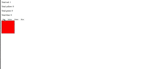

Color Blocks
========

In this challenge I created an application that will create a colored `
` tag each time the corresponding color is clicked. As each color (button) is clicked, it will increment the corresponding label.

Features
--------

- Click a button with a color on it and a box of that color will be added on the DOM
- The counter at the top will change to match the current number of that color cube on the screen
- Clicking on a colored cube will remove it from the screen and update the counter

Here is a gif of how things look like in action:

